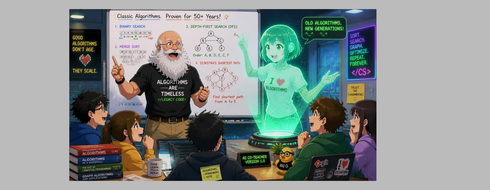

# AI Education Project

A teaching library for developers working in an AI-assisted world. It has two curricula, a diagnostic method, and a mentoring model that ties them together.

The idea behind the whole repo: AI now writes a large share of the code. The developer's job is moving toward specifying the right thing, checking what comes back, and owning the calls AI can't make. That takes *more* computer science and design judgment, not less. It also takes a disciplined way to diagnose problems and a way to pass these skills down through a team.



## What's in here

| Area | Where | What it gives you |
|---|---|---|
| **Computer Science in AI** | [`computer-science-in-ai-curriculum/`](computer-science-in-ai-curriculum/README.md) | 32 fully outlined 50-minute talks (27 backbone subjects plus 5 algorithm deep-dives), ranked Critical / Important / Optional for AI-assisted development. Also ~3,300 talk titles drawn from seven university curricula. |
| **Software Design & Architecture** | [`computer-science-software-design-and-architecture/`](computer-science-software-design-and-architecture/README.md) | 33 topics in 8 parts, from clean code to the architect role. Each has a ~55-minute session plan, homework, and a free companion resource. A few include Python starter code. |
| **The Scientific Method for Diagnostics** | [`scientific-method/`](scientific-method/README.md) | A hypothesis-driven way to diagnose problems. It has playbooks and tooling for frontend, backend, database, QA, DevOps, cloud, infrastructure, and security. |
| **Tiered Mentoring** | [`mentoring/`](mentoring/README.md) | A move away from "Seniors teach Juniors the codebase" to a tiered model. Seniors mentor Mid-levels on computer science. Mid-levels mentor Juniors on using AI in the current codebases. |

## Quick start

Pick the entry point that matches why you're here.

- **You're a Junior developer.** Start with your Mid-level mentor and the [Mid → Junior track](mentoring/mid-to-junior.md). Read the Critical talks in the [CS in AI curriculum](computer-science-in-ai-curriculum/README.md#critical--ai-makes-weakness-here-dangerous-not-just-shallow) alongside it.
- **You're a Mid-level developer.** You mentor *and* get mentored. Read [Senior → Mid](mentoring/senior-to-mid.md) for what you'll study, and [Mid → Junior](mentoring/mid-to-junior.md) for what you'll teach.
- **You're a Senior developer or lead.** Read the [mentoring overview](mentoring/README.md), then the [program operations guide](mentoring/program-operations.md) to roll it out.
- **You're chasing a bug or outage.** Go straight to the [Scientific Method](scientific-method/README.md) and open the playbook for your layer.
- **You're teaching a class or a lunch-and-learn.** Every talk and topic file is self-contained. Pick one from either curriculum and give it.

## Documentation

Guides to the curricula live in [`docs/`](docs/README.md). The Scientific Method and Mentoring have their own top-level folders.

- [Repository structure](docs/repository-structure.md): every folder and file type, and the conventions they follow
- [CS in AI curriculum guide](docs/cs-in-ai-curriculum.md): how the 32 talks and seven school checklists fit together
- [Software Design & Architecture guide](docs/software-design-and-architecture.md): the 8 parts, the file layout per topic, and the capstone
- [Learning paths](docs/learning-paths.md): suggested sequences through both curricula by role and level
- [Scientific Method](scientific-method/README.md): the method, the experiment log, and eight domain playbooks
- [Mentoring](mentoring/README.md): the tiered model, both tracks, and how to run it

## How the pieces connect

```text
            Senior developers
                   │  mentor on computer science & architecture
                   │  (CS in AI talks, Design & Architecture topics,
                   │   Scientific Method as the diagnostic discipline)
                   ▼
           Mid-level developers
                   │  mentor on AI-assisted development in the real codebases
                   │  (prompting, reviewing AI output, testing, diagnosing
                   │   with the Scientific Method playbooks)
                   ▼
            Junior developers
```

The curricula are the *content*. The Scientific Method is the *working discipline* that every tier practices. The mentoring model is the *delivery system*.

## Sources and license

Curriculum content is derived from public university catalogs (Amherst, BGSU, Purdue, MIT OCW, Harvard, Stanford, CMU) and three [roadmap.sh](https://roadmap.sh) guides. Each sub-project's README records its sources and methodology. The CS in AI curriculum is published under the [MIT License](computer-science-in-ai-curriculum/LICENSE), copyright 2026 Bob Fornal.
